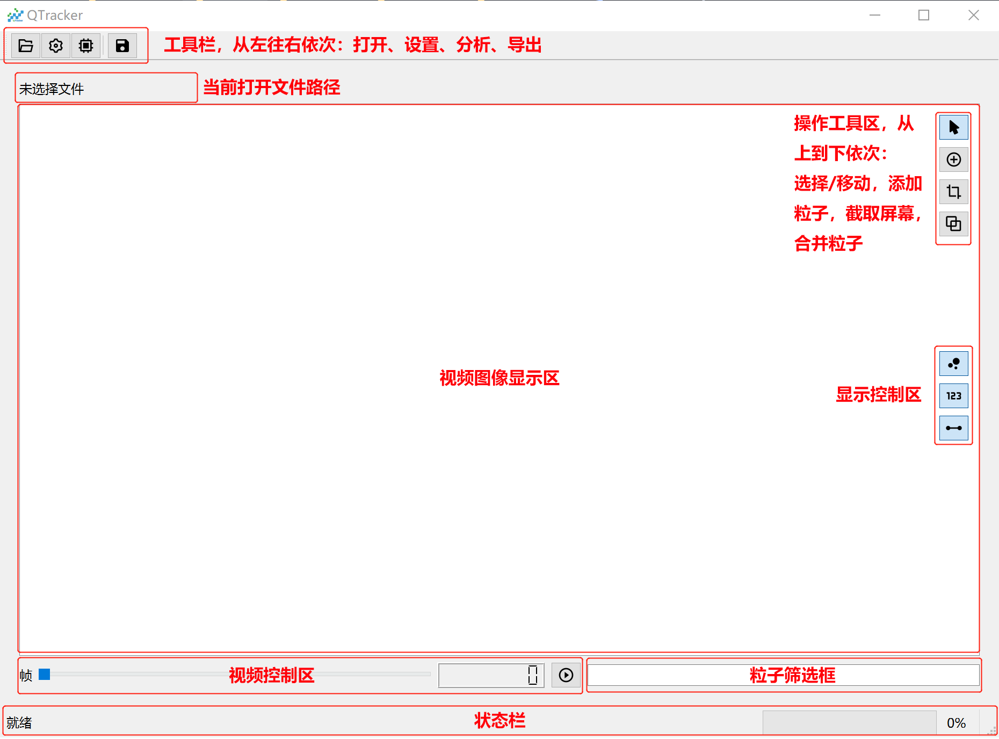
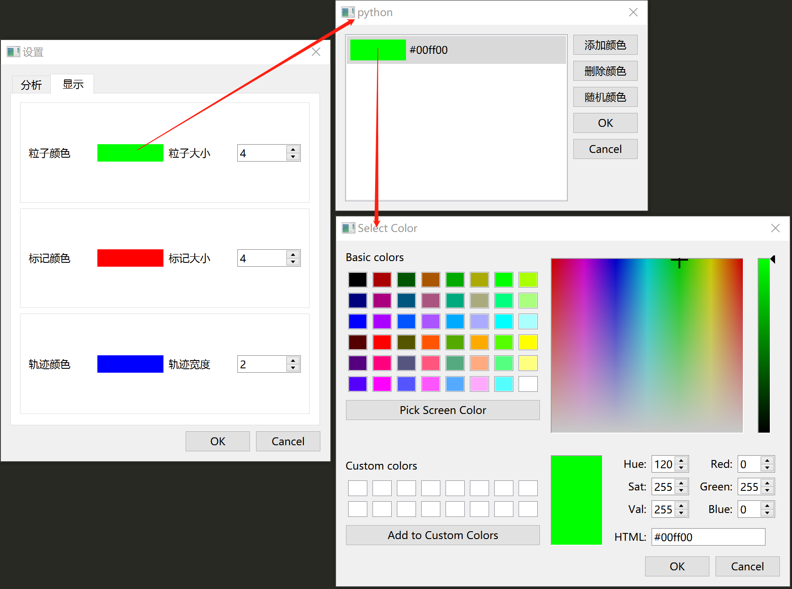

## 使用说明

### 各按钮功能说明
- 工具栏
  - 打开：打开一个视频文件，当前仅支持.avi，后续可添加文件类型支持
  - 设置：打开设置窗口，可对粒子分析和显示进行设置，详见设置部分
  - 分析：对视频进行读取、粒子识别及轨迹跟踪
  - 导出：将分析的结果导出，保存为视频，目前仅支持.avi，后续可添加文件类型支持
  
- 视频显示区：视频图像显示区域，主要的操作区域
  - 选择/移动：该按钮激活时可双击鼠标选中粒子，按住左键拖拽可移动粒子，按住Ctrl双击鼠标可选中多个粒子
  - 添加粒子：激活该按钮后，在视频显示区内单击鼠标，可以添加一个粒子，具体操作见xx
  - 截取屏幕：可设置导出视频的显示范围，该功能暂未实现  
  - 合并粒子：未选中粒子时，点击该按钮会弹出对话框要求输入合并的粒子编号；选中多个粒子时点击按钮会将选中的粒子进行合并，详见xx
  - 显示/隐藏粒子：控制粒子的显示/隐藏
  - 显示/隐藏标签：控制标签的显示/隐藏
  - 显示/隐藏轨迹：控制轨迹的显示/隐藏
  
- 视频控制区：通过滑块控制显示视频的哪一帧，右侧数字显示格式为"当前帧-总帧数"
  - 播放：播放视频，该功能暂未实现
  
- 筛选框：为空时显示所有粒子，输入内容后根据内容进行筛选，支持单个粒子和连续编号粒子筛选，空格或者英文逗号分隔，连续编号用"-"相连
  - 例1："1 3 5 7 9"将会筛选出编号为1,3,5,7,9的粒子，其它粒子将被隐藏
  - 例2："1-5 10,15"将会筛选出编号为1,2,3,4,5,10,15的粒子，其它粒子将被隐藏
  
- 状态栏：显示一些状态和进度

### 操作说明
1. 打开文件：点击打开按钮，选择要分析的视频
2. 设置参数：点击设置按钮，设置分析模块各个参数
3. 分析：点击分析按钮，进行粒子分析，期间下方状态栏会显示分析进度，分析过程中可拖动帧控制滑块查看已分析完的帧
4. 调整：分析结束后，可对分析结果进行手动调整
  - 移动粒子（仅对当前显示帧有效），在选择/移动按钮激活的情况下可对粒子位置进行调整
  - 添加粒子（仅对当前显示帧有效），在添加粒子按钮激活的情况下，在视频显示区单击鼠标，会弹出对话框，输入粒子编号后，可将粒子添加在鼠标单击位置；
    如果当前帧存在相同编号粒子，会弹出对话框提示，如果确定，该粒子会移动到鼠标位置
  - 删除粒子（仅对当前显示帧有效），选中（一个或多个）粒子后，按下Delete键，会删除选中的粒子
  - 合并粒子（对视频所有帧有效），该功能主要用作同一个粒子在分析过程中出现多个编号，比如1-20帧该粒子编号是3，21-50帧粒子编号变为10，
    出现这种情况后粒子轨迹会分成两段，因此需要将3和10号粒子进行合并；具体操作如下：未选中任何粒子时，点击合并粒子按钮，
    会弹出对话框要求输入要合并的粒子，规则与粒子筛选框一致；在选中粒子的情况下，点击合并粒子按钮，会直接将选中的粒子合并
  - 显示设置，视频显示区右下方的显示/隐藏按钮可以控制不同元素的显示和隐藏，设置中的显示模块可以控制不同元素的颜色、大小，筛选框可以按编号进行显示过滤
5. 导出视频：调整完成后，可以滑动滑块查看每一帧的图像，点击导出按钮，可以将图像导出为视频，视频内容与视频显示区显示图像一致

### 设置说明
- 分析参数设置：不细说，与之前的操作没有区别
- 显示参数设置：如下图，点击色块会弹出颜色设置框，颜色设置框可以设置多个颜色，双击每个颜色框可以弹出颜色选择器，
设置多个颜色时，粒子会按顺序依次显示各个颜色，比如，粒子颜色设置了红、绿、蓝三个颜色，编号为1、4、7...的粒子将显示红色
  编号为2、5、8...的粒子将显示绿色，编号为3、6、9...的粒子显示蓝色；粒子、标签、轨迹可以分别设置。
  

